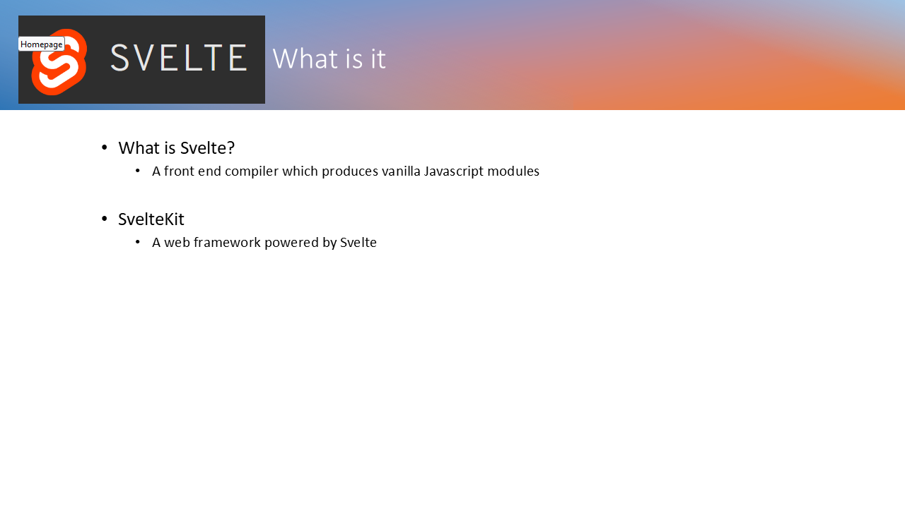
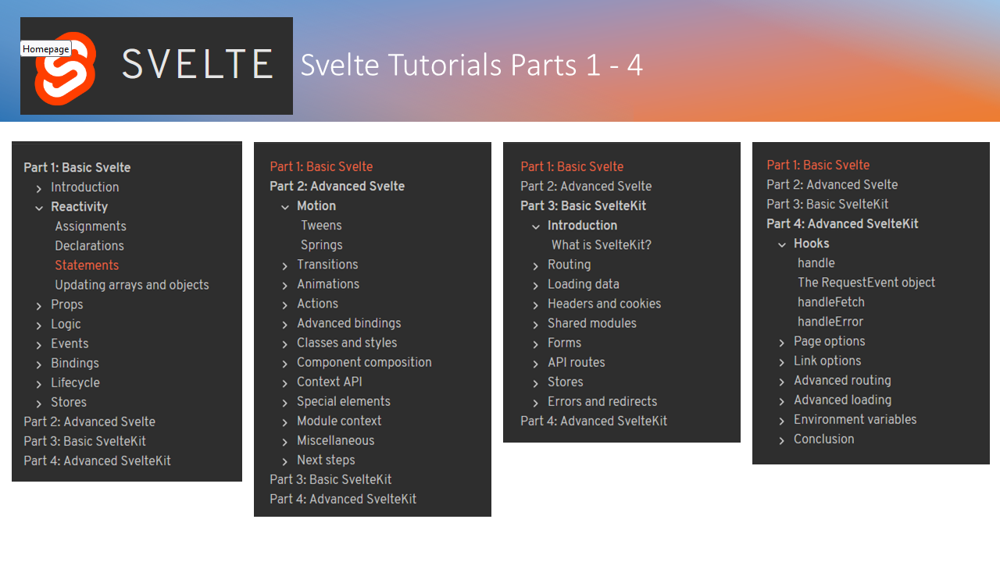

# Heading 1

normal text

## Heading 2

normal text

### Heading 3

normal text

**Double asterix enboldens**
1. First item  
2. Second item
3. Third item

> node --version

``` javascript
           <div>
              {users.map((user) => (
                <Card>
                  <Card.Body>
                  <Card.Title key={user.id}>{user.name}</Card.Title>
                  <Card.Subtitle key={user.id}>{user.email}</Card.Subtitle>
                  <Card.Text key={user.id}>{user.company.name}</Card.Text>
                  </Card.Body>
                </Card>
            ))}
          </div>
```

Card is a component from Bootstrap formatted with React Bootstrap.


Descriptive text here


Descriptive text here


Descriptive text here